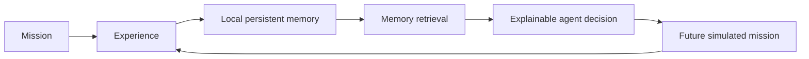
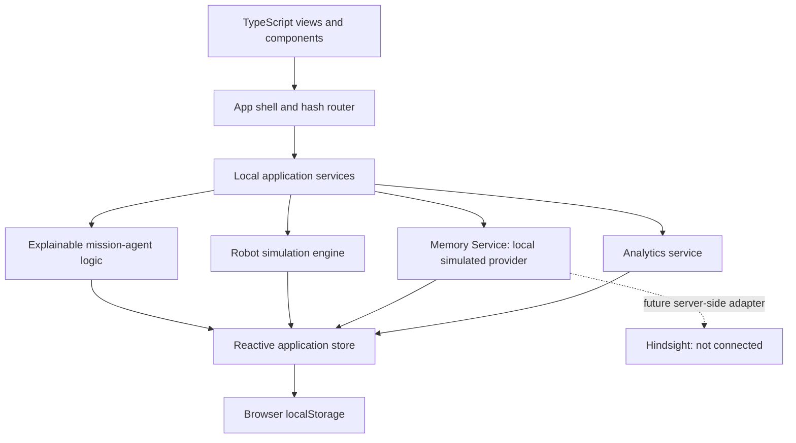

# FleetMinder

## Autonomous Robot Mission Learning with Persistent Agent Memory

FleetMinder is a browser-based operations prototype for exploring how autonomous robot fleets can carry useful mission experience into future plans. It combines a simulated fleet and 2D mission environment with an explainable local mission agent and a browser-persisted memory service.

Autonomous systems can repeatedly encounter the same obstacles when past outcomes are not available at planning time. FleetMinder demonstrates a local mission-to-memory loop: operators inspect what happened, save a mission experience, and see a later simulated mission retrieve that experience and use it to choose a route.

> **Implementation boundary:** Robot behavior, telemetry, outcomes, and agent decisions are simulated. Memory records are application data persisted in this browser, not Hindsight. There is no server, external API, language model, or physical robot connection in this project.

## Core Idea



## Key Features

- Command dashboard with fleet health, mission activity, alerts, and memory activity.
- Robot fleet profiles, simulated telemetry, maintenance records, and robot comparison.
- Mission creation and controls, with clean, obstacle, low-battery, communication, and memory-conflict scenarios.
- Responsive 2D route simulation with checkpoints, obstacles, progress, and alternate paths.
- Local memory creation from a completed mission, relevance-based retrieval, conflict review, and memory evolution.
- Explainable mission-agent timeline and an operations assistant grounded in application data.
- Mission history, post-mission reports, event timelines, and mission replay.
- Analytics for fleet performance and simulated memory-assisted decisions.
- Demo Mode for the Warehouse A obstacle, experience-save, recall, and preemptive-reroute walkthrough, including Reset Demo.
- Responsive navigation, filters, notifications, and global search.

## Architecture



There is no backend/API layer in the current implementation. Views and components are under `src/views` and `src/components`; navigation and shell behavior are in `src/shell.ts` and `src/router.ts`; domain state and seed data are in `src/data`; mission simulation, memory, agent, analytics, and time logic are separated under `src/services`.

## Hindsight Integration

Hindsight is not connected or called by this prototype. The current Memory Service stores simulated memories in the browser's application state. Completing a mission does not silently persist a memory: the operator can save the proposed experience from the mission report. Planning then scores available memories using robot and environment match, destination/tag match, mission context, text overlap, and recency. The resulting memory IDs and route decisions are recorded in the simulated mission timeline.

A real Hindsight integration belongs behind a server-side adapter implementing the Memory Service boundary. The browser app has no API credentials or server-side secret handling. Do not enter real credentials into this prototype or treat local records as Hindsight data.

## Mission Learning Loop

1. A simulated mission records route progress, telemetry, and events.
2. The operator reviews its outcome and can save the suggested experience.
3. The Memory Service stores that record in browser-persisted application state.
4. A later mission queries memories against the selected robot and mission context.
5. The mission agent records its retrieved evidence, rationale, and simulated route decision.
6. The next mission creates another opportunity to record experience.

## Example Scenario

On the first R-01 inspection of Warehouse A, the simulator blocks Corridor B. The agent records the event and selects a route through Corridor C. The operator saves that experience in the post-mission report. In the guided repeat mission, R-01 starts from Dock Bay; planning retrieves the Corridor B memory and selects the Corridor C route before the obstacle is encountered.

This is controlled simulation behavior, not evidence from physical robots or a deployed memory system.

## Technology Stack

- TypeScript 5.5
- Vite 5
- Browser DOM APIs and CSS
- Browser `localStorage` for application-state persistence

There are no runtime npm dependencies, server framework, or database in the current project.

## Project Structure

```text
src/
	components/  Shared charts, maps, icons, command palette, and UI helpers
	data/        Domain types, deterministic seed data, environments, and store
	services/    Simulation, memory, agent, analytics, and time logic
	views/       Dashboard, missions, fleet, memory, analytics, settings, and more
	main.ts      Application startup and active simulation restoration
	router.ts    Hash-based navigation
	shell.ts     Persistent app shell, navigation, notifications, and demo guide
scripts/       Development/test scripts; not wired to npm scripts
index.html     Vite entry point
vite.config.ts Vite configuration
```

## Getting Started

Requirements: Node.js and npm.

```sh
npm install
npm run dev
```

Create and preview a production build:

```sh
npm run build
npm run preview
```

`npm run typecheck` runs the TypeScript compiler without emitting files.

## Environment Variables

None are used by the current application. No API keys or external service credentials are required.

## Demo Walkthrough

1. Start the development server and open the Vite URL.
2. Choose **Demo Mode** in the navigation.
3. Watch R-01 encounter the Corridor B obstacle and complete its reroute.
4. Save the suggested experience from the mission report.
5. Watch the follow-up mission retrieve the saved experience and choose Corridor C during planning.
6. Use **Reset Demo** in the guide to restore the initial seeded dataset. Reset clears local application changes in this browser and restores default settings.

## Reliability and Safety Notes

The simulation engine and its telemetry are not connected to hardware. The mission agent uses deterministic application logic, not a general-purpose AI model. Active mission records are persisted and the simulation engine rebuilds active runs from their saved routes after a page reload. State remains local to this browser; clearing browser storage removes it. A retrieved memory is simulated historical context and should not be treated as verified real-world guidance.

## Future Work

- Add a server-side data and API layer with authenticated sessions.
- Implement a real Hindsight adapter and evaluate retrieval quality against mission outcomes.
- Integrate ROS/ROS 2, physical robot telemetry, and validated navigation systems.
- Add multi-robot coordination, deployment monitoring, and edge operation.

No license file is currently included.
