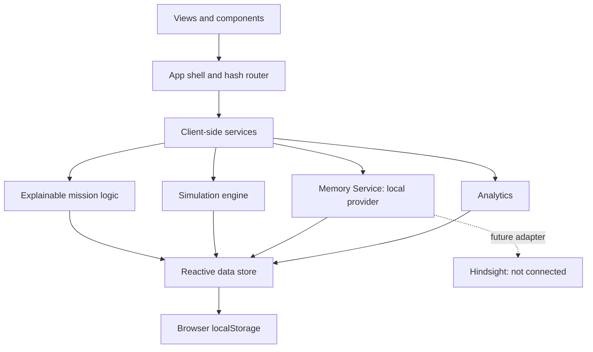

# FleetMinder: Teaching Autonomous Robot Fleets to Learn from Mission Experience with Persistent Agent Memory

Fleet operations systems can record a mission without carrying its useful lessons into the next plan. FleetMinder is a browser prototype that makes this gap visible through a simulated mission, a local memory service, and an explainable planning timeline. It demonstrates the software pattern; it is not a connected robot fleet or a live Hindsight deployment.

## 1. The Problem

Autonomous robots repeatedly encounter changing routes, obstacles, and operating conditions. If a planner starts each task from the same baseline, a route obstruction discovered during one mission may be rediscovered by the next. A mission log alone does not ensure that relevant experience will be available when a later decision is made.

## 2. Why Persistent Memory Matters

Short-term context belongs to the current mission: its destination, active route, progress, telemetry, and recent events. Persistent operational memory is prior experience retained beyond that mission and made available to a future one.

History and memory are related but not identical. A history view records what happened; a memory service selects records that appear relevant to a current context. Selection needs to expose its evidence because an old or context-mismatched observation can be misleading. In FleetMinder, relevance is prototype scoring, not proof that a memory is currently true.

## 3. Introducing FleetMinder

FleetMinder is a TypeScript and Vite web application with a command dashboard, fleet profiles, mission control, a 2D simulator, mission history and replay, analytics, alerts, and operations assistant. Five seeded robots and historical records give the prototype meaningful initial state.

Robot movement, telemetry, outcomes, and agent behavior are simulated. The operations assistant uses local application data and rules; it is not a language model. The memory service stores browser-persisted records; it is not Hindsight.

## 4. Architecture

Views and reusable UI components render data from a reactive client-side store. The hash router and app shell manage navigation. Separate services implement mission simulation, memory retrieval, agent responses, and analytics. Store updates persist to browser `localStorage`.

There is no backend/API service in the current project. A real Hindsight integration would require a server-side adapter behind the Memory Service; credentials must not be placed in browser code.

## 5. The Memory Loop

The prototype implements the following local workflow:

1. A simulated mission records route progress, events, and telemetry.
2. The post-mission report derives a candidate experience; the operator explicitly saves it.
3. The Memory Service stores the memory in browser-persisted application state.
4. A later mission queries memory during planning.
5. The agent records the relevant memory IDs, route decision, and rationale in the mission timeline.
6. The later mission can itself become a source of new experience.

## 6. Mission Example

During the first R-01 inspection of Warehouse A, the obstacle scenario blocks Corridor B. The simulator records the obstacle and the agent reroutes via Corridor C. The operator can save that outcome from the mission report.

For the guided repeat inspection, R-01 is staged at Dock Bay. Planning retrieves the saved Corridor B experience and chooses a route via Corridor C before reaching the obstruction. The mission timeline shows the retrieved record, the identified risk, the route choice, and the resulting path. This is a controlled demo scenario, not a physical robot result.

## 7. Hindsight's Role

Hindsight is not integrated. The prototype currently stores simulated memory records in the same local application store as mission state. Mission completion can propose an experience; the operator chooses whether to save it. Later planning retrieves records using robot, environment, destination, mission context, text overlap, and recency.

The project does not send memories to Hindsight, query a Hindsight bank, or configure an API key. The Memory Service is the intended provider boundary for a future server-side integration. Until that exists, the accurate description is local simulated memory, not Hindsight-backed persistent agent memory.

## 8. Explainability

The mission timeline distinguishes simulation events, agent steps, memory retrievals, and decisions. It records which memory IDs were considered and gives a concise route rationale. This makes the prototype's decision auditable without presenting hidden chain-of-thought or implying that a model is controlling a robot.

The relevance score is a simulated heuristic. Matching environment and robot context, destination tags, text overlap, and recency can change the score. It is not a calibrated probability, confidence guarantee, or measure of physical safety.

## 9. Handling Conflicting Experience

Historical records can disagree: one may describe Corridor C as a successful route while a newer one reports it blocked. FleetMinder includes seeded conflicts and a scenario that surfaces disagreement for review. The local conflict detector uses shared tags and a small set of contradictory terms; it is a demonstration, not a robust conflict-resolution model. Recency and context can inform an operator, but neither makes a memory automatically correct.

## 10. Simulation

The simulator advances active missions on a controlled interval over predefined environment graphs. Scenarios can inject a blocked route, low battery, degraded communication, or conflicting experience. The map and mission event timeline update from simulation state.

Simulation makes route logic and state transitions easier to demonstrate and repeat. It does not validate sensor models, localization, collision avoidance, communications, or real-world navigation.

## 11. Engineering Challenges

The most important implementation issue was duplicated ownership of mission completion: a global progress watcher scheduled completion in addition to the simulation engine. Removing the second completion path leaves the engine as the single owner. Persisted mission records also outlive in-memory timers, so startup now reconstructs active simulation state from the saved route.

The demo flow exposed related edge cases: post-mission reports needed to use the registered history route, the seeded active mission could occupy R-01, and a route-description memory could mention both a hazard and a safe alternative. The prototype now routes reports correctly, reserves R-01 for the guide, and associates hazard language with the nearby named route node. Mobile flex sizing required explicit minimum-width constraints so table scrollers do not widen the page.

## 12. Reliability

The simulator owns one interval for active runs. Demo phase and boost timers are tracked and cleared on exit or reset. Reset restores seeded local data without a page reload. Active and paused mission records are used to rebuild simulator state at startup. The application uses synchronous in-memory state updates with debounced local persistence; there are no remote requests to retry or fail over in this build.

These are prototype reliability measures, not production durability guarantees. Browser storage can be cleared or unavailable, and there is no multi-user consistency or server backup.

## 13. Limitations

- No physical robots, ROS/ROS 2 integration, real telemetry, backend API, or Hindsight connection.
- Robot actions, mission outcomes, memory relevance, and agent reasoning are simulated.
- Memory resides in browser local storage and is scoped to that browser profile.
- Retrieval does not evaluate payload, live environmental conditions, or verified memory outcomes.
- The conflict detector and assistant use limited deterministic application logic.
- The UI is an operations prototype, not a safety-certified control system.

## 14. Future Work

Next steps include a server-side API and authenticated data layer, a real Hindsight adapter with retrieval evaluation, context-aware memory validation and retirement, and read-only integration with ROS/ROS 2 or physical telemetry. Multi-robot coordination and edge deployment should follow only after simulation behavior and operational safeguards have been validated.

## 15. Conclusion

FleetMinder demonstrates a concrete software pattern: a mission produces experience, a memory layer makes selected experience available later, and an explainable agent can use that context in a future simulated decision. The value is not a claim that robots learn autonomously today; it is making the mission-to-memory-to-decision loop visible, inspectable, and ready for careful real integrations.
